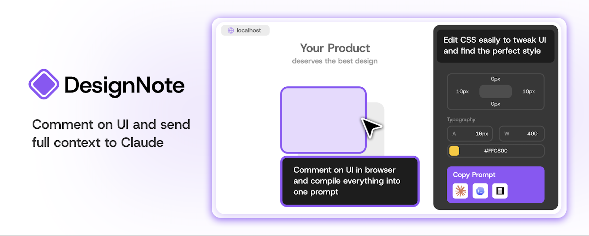

---

**DesignNote** is a Chrome extension that lets you visually annotate UI elements on any webpage, make live CSS tweaks, and generate a structured prompt to send directly to Claude.

---

## Features

- **Click-to-pin elements** — hover to highlight, click to pin with a numbered badge
- **Inline comments** — type a note right on the page, next to the element
- **Live CSS editing** — tweak padding, margin, font size, color, border-radius, and more with draggable sliders
- **Style highlighting** — see the box model area you're editing highlighted in real-time
- **Responsive simulator** — scale the page to any viewport width, just like DevTools
- **Embed mode** — push the page left instead of overlapping it
- **Prompt builder** — one click generates a structured, copy-ready prompt with selectors, style diffs, and comments for Claude
- **Shadow DOM isolation** — the sidebar never pollutes host page styles

---

## Usage

1. Load the extension in `chrome://extensions` (unpacked, from the `dist/` folder)
2. Press **Ctrl+Shift+D** or click the extension icon to open the sidebar
3. Click any element on the page to pin it and add a comment
4. Adjust styles in the sidebar's style editor
5. Switch to the **Prompt** tab, copy the generated prompt, and paste it into Claude

---

## Tech Stack

- **React 18** + TypeScript
- **Vite** + [@crxjs/vite-plugin](https://crxjs.dev) for MV3 bundling
- **Zustand** for state management
- Chrome Manifest V3 (content script + service worker)

---

## Development

```bash
npm install
npm run dev        # watch mode — outputs to dist/
```

Load the `dist/` folder as an unpacked extension in `chrome://extensions`.

---

## Project Structure

```
src/
├── background/        # MV3 service worker
├── content/           # Content scripts (element selection, style injection, responsive frame)
├── sidebar/           # React sidebar (components, store, styles)
└── assets/            # Logo and static assets
```
